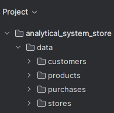
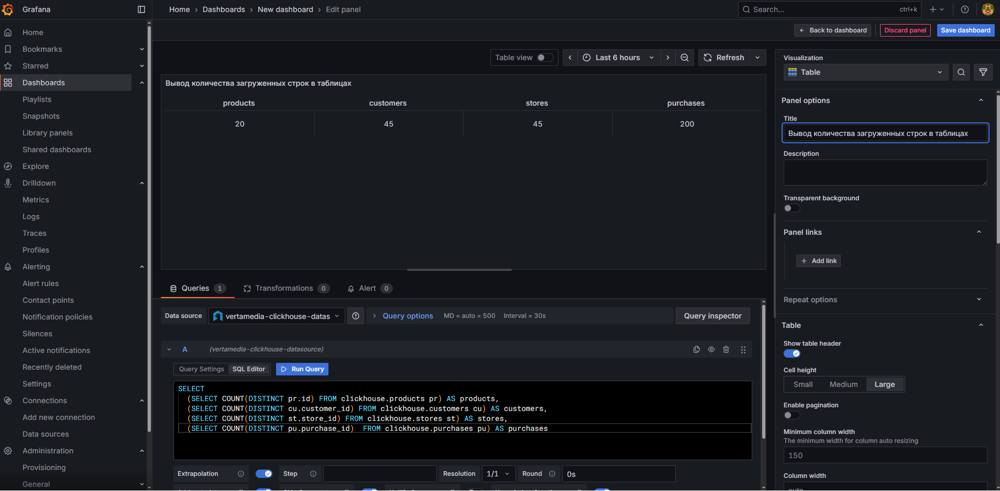
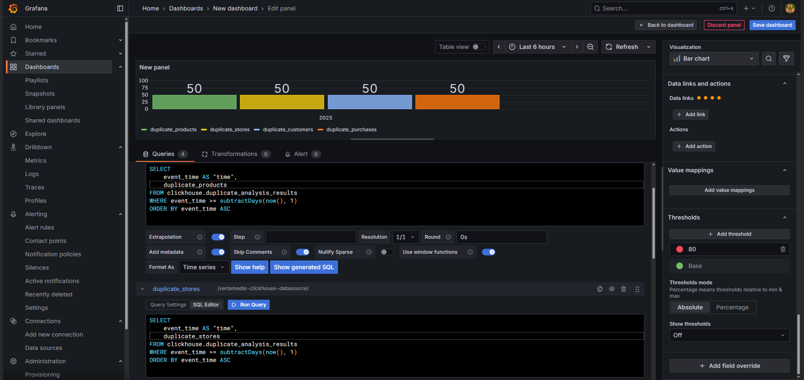
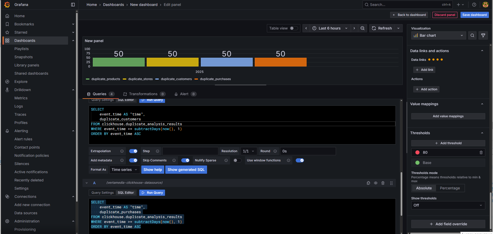
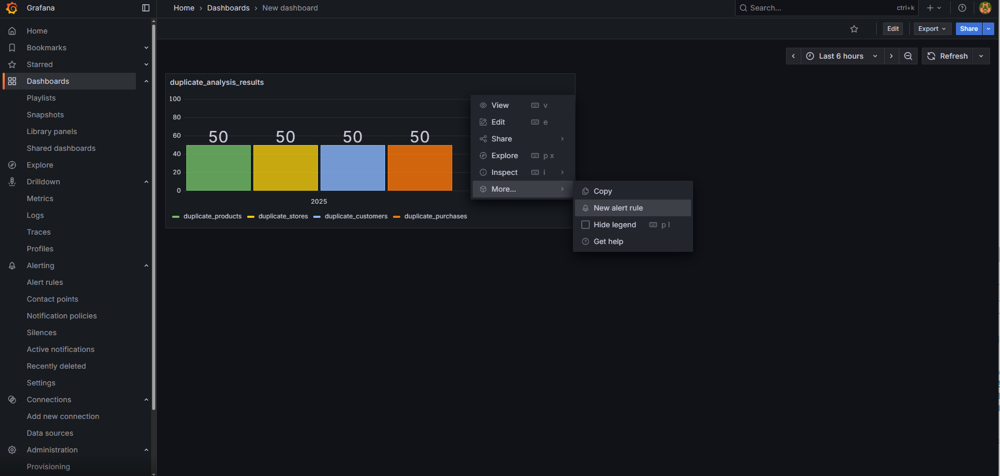
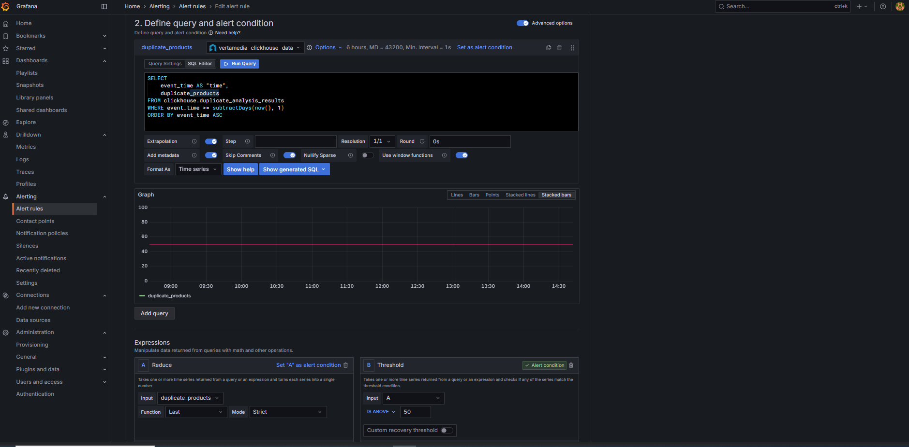
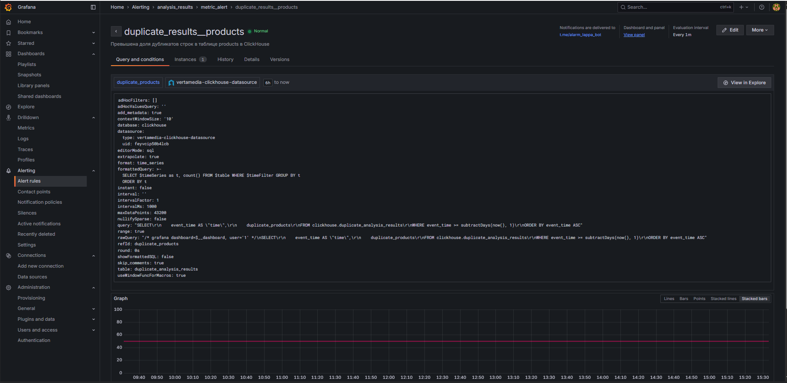
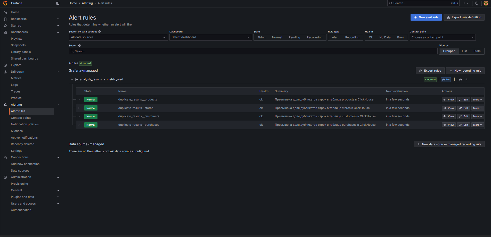
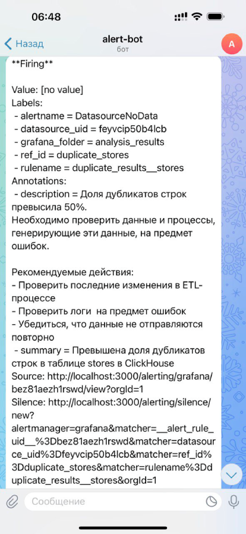

# Проект аналитической системы для сети магазинов "Пикча"


## Описание проекта

Разработка аналитической системы для сетевого магазина "Пикча", которая позволит эффективнее и выгоднее продавать товары. Заказчик запрашивает демо-версию рабочего инструмента перед предоставлением доступа к NoSQL хранилищу.

## Структура сети магазинов

1. **Большая Пикча** (помещение более 200 кв.м.)
   - 30 магазинов по стране (некоторые в одном городе)

2. **Маленькая Пикча** (помещение менее 100 кв.м.)
   - 15 магазинов по стране (некоторые в одном городе)

## Ассортимент товаров

В каждом магазине представлены товары пяти основных продовольственных групп:

1. 🥖 Зерновые и хлебобулочные изделия
2. 🥩 Мясо, рыба, яйца и бобовые
3. 🥛 Молочные продукты
4. 🍏 Фрукты и ягоды
5. 🥦 Овощи и зелень

В каждую группу входит не менее 20 позиций (всего около 100 товаров в ассортименте).

## Структура данных

### Товар

```json
{
  "id": "prd-0037",
  "name": "Творог 5%",
  "group": "Молочные",
  "description": "Творог из коровьего молока, 5% жирности",
  "kbju": {
    "calories": 121,
    "protein": 16.5,
    "fat": 5,
    "carbohydrates": 3.3
  },
  "price": 89.99,
  "unit": "упаковка",
  "origin_country": "Россия",
  "expiry_days": 12,
  "is_organic": false,
  "barcode": "4600111222333",
  "manufacturer": {
    "name": "ООО Молочный Комбинат",
    "country": "Россия",
    "website": "https://moloko.ru",
    "inn": "7723456789"
  }
}
```

| Поле | Тип | Описание |
|------|-----|----------|
| id | string | Уникальный идентификатор товара в системе |
| name | string | Название продукта |
| group | string | Продовольственная группа |
| description | string | Краткое описание товара |
| kbju | object | Пищевая ценность на 100 г продукта |
| price | number | Стоимость товара за единицу |
| unit | string | Единица измерения (упаковка, кг, л, шт) |
| origin_country | string | Страна происхождения товара |
| expiry_days | integer | Срок годности в днях |
| is_organic | boolean | Органический ли продукт |
| barcode | string | Штрихкод товара (EAN-13) |
| manufacturer | object | Информация о производителе |

### Покупатель

```json
{
  "customer_id": "cus-102345",
  "first_name": "Алексей",
  "last_name": "Иванов",
  "email": "alexey.ivanov@example.com",
  "phone": "+7-900-123-45-67",
  "birth_date": "1990-04-15",
  "gender": "male",
  "registration_date": "2023-08-20T14:32:00Z",
  "is_loyalty_member": true,
  "loyalty_card_number": "LOYAL-987654321",
  "purchase_location": {
    "store_id": "store-001", 
    "store_name": "Большая Пикча — Магазин на Тверской",
    "store_network": "Большая Пикча",
    "store_type_description": "Супермаркет площадью более 200 кв.м.",
    "country": "Россия",
    "city": "Москва",
    "street": "ул. Тверская",
    "house": "15",
    "postal_code": "125009"
  },
  "delivery_address": {
    "country": "Россия",
    "city": "Москва",
    "street": "ул. Ленина",
    "house": "12",
    "apartment": "45",
    "postal_code": "101000"
  },
  "preferences": {
    "preferred_language": "ru",
    "preferred_payment_method": "card",
    "receive_promotions": true
  }
}
```

| Поле | Описание | Примечание                                           |
|------|----------|------------------------------------------------------|
| customer_id | Уникальный идентификатор клиента | Всегда указывается                                   |
| first_name/last_name | Имя и фамилия | Может быть NULL                                      |
| email | Адрес электронной почты | Может быть NULL                                      |
| phone | Номер телефона | Всегда указывается                                   |
| birth_date | Дата рождения | Для акций, идентификации                             |
| gender | Пол | male, female, other, null                            |
| registration_date | Дата регистрации в системе | Всегда указывается                                   |
| is_loyalty_member | Признак участия в программе лояльности | Всегда True                                          |
| loyalty_card_number | Номер карты лояльности | Всегда указывается |
| purchase_location | Адрес магазина, где была совершена покупка | Всегда указывается                                   |
| delivery_address | Адрес доставки | По умолчанию это адрес, где оформляется карта клиента |

### Магазин

```json
{
  "store_id": "store-001",
  "store_name": "Большая Пикча — Магазин на Тверской",
  "store_network": "Большая Пикча",
  "store_type_description": "Супермаркет площадью более 200 кв.м.",
  "type": "offline",
  "categories": [
    "🥖 Зерновые и хлебобулочные изделия",
    "🥩 Мясо, рыба, яйца и бобовые",
    "🥛 Молочные продукты",
    "🍏 Фрукты и ягоды",
    "🥦 Овощи и зелень"
  ],
  "manager": {
    "name": "Светлана Петрова", 
    "phone": "+7-900-555-33-22",
    "email": "manager@tverskoy-store.ru"
  },
  "location": {
    "country": "Россия",
    "city": "Москва",
    "street": "ул. Тверская",
    "house": "15",
    "postal_code": "125009",
    "coordinates": {
      "latitude": 55.7575,
      "longitude": 37.6156
    }
  },
  "opening_hours": {
    "mon_fri": "09:00-21:00",
    "sat": "10:00-20:00",
    "sun": "10:00-18:00"
  },
  "accepts_online_orders": true,
  "delivery_available": true,
  "warehouse_connected": true,
  "last_inventory_date": "2025-06-28"
}
```

## Ключевые требования

1. Разработать демо-версию аналитической системы без доступа к NoSQL хранилищу заказчика
2. Учесть структуру данных о товарах, покупателях и магазинах
3. Цифровой портрет покупателя возможен только при наличии бонусной карты

## Реализация решения

### Запуск проекта

Для запуска проекта используется Docker Compose:

- [docker-compose.yml](/docker-compose.yml)
- [Dockerfile](/Dockerfile)
- [users.xml](/users.xml)


### Генерация и загрузка данных

#### Генерация тестовых данных

Для имитации взаимодействия с заказчиком создан скрипт [generate_synthetic_data.py](/generate_synthetic_data.py), который генерирует следующие тестовые данные:

1. 45 JSON-файлов, описывающих каждый магазин
2. 20 JSON-файлов, описывающих товары
3. 45 JSON-файлов, описывающих покупателей (по 1 покупателю в каждом магазине)
4. 200 JSON-файлов, описывающих покупки от различных покупателей в разных магазинах

Эти файлы сохраняются в директории `data` проекта, разделенные по соответствующим папкам.



#### Загрузка данных в MongoDB

1. С помощью скрипта [load_data_mongo.py](load_data_mongodb/load_data_mongo.py) загружаем все JSON-файлы в NoSQL хранилище MongoDB. 

2. Проверяем загрузку с помощью скрипта [check_mongo_data.py](load_data_mongodb/check_mongo_data.py).
</br>Настройки подключения хранятся в файле [.env](load_data_mongodb/.env)

#### Потоковая обработка через Kafka

Для загрузки данных из MongoDB в ClickHouse используется Kafka:

1. Устанавливаем необходимую библиотеку: `pip install kafka-python`
2. Созданы файлы [producer.py](mongodb_kafka_clickhouse/producer.py) и [consumer.py](mongodb_kafka_clickhouse/consumer.py) для работы с Kafka
3. Настройки подключения хранятся в файле [.env](mongodb_kafka_clickhouse/.env)

**Producer.py**:
- Считывает данные из MongoDB
- Приводит их к единому виду
- Хеширует конфиденциальную информацию (email и телефоны)
- Отправляет данные в топики Kafka
- Добавляет поле `event_time` (дата загрузки)

**Consumer.py**:
- Принимает сообщения из топиков Kafka
- Создает таблицы в ClickHouse (RAW-слой)
- Преобразует вложенные JSON-структуры в столбцы таблиц
- Сохраняет полные данные в поле `json_data`
- Отправляет данные в ClickHouse

Данные в "сыром слое" хранятся 180 дней с момента их загрузки в ClickHouse, а затем удаляются.

### Архитектура хранилища данных

#### Слой MART в ClickHouse

Для нормализации данных до 3NF созданы таблицы фактов и измерений (файл со скриптом [Script_mart.sql](Clickhouse_MART/Script_mart.sql)):

**Таблицы фактов**:
- `fact_purchases` - содержит информацию о транзакциях покупок (время, покупатель, магазин, суммы, метод оплаты)
- `fact_purchase_items` - содержит позиции товаров в каждой покупке (количество, цена и стоимость)

**Таблицы измерений**:
- `dim_customers` - информация о клиентах (персональные данные, предпочтения, участие в программе лояльности)
- `dim_products` - информация о продуктах (наименование, категория, цена, КБЖУ, производитель)
- `dim_stores` - информация о магазинах (название, сеть, тип, адрес, часы работы)
- `categories` - справочник категорий товаров
- `manufacturers` - справочник производителей
- `store_networks` - справочник торговых сетей
- `addresses` - справочник нормализованных адресов
- `store_categories` - таблица связи "многие-ко-многим" между магазинами и категориями
- `duplicate_analysis_results` - таблица с анализом дубликатов при загрузке данных

#### Особенности реализации

**Для таблиц измерений**:
- Используется движок `ReplacingMergeTree()`
- Старые данные сохраняются для исторического анализа

**Для таблиц фактов**:
- Используется `ReplacingMergeTree()` + TTL
- Записи старше 360 дней удаляются

**Проверка дублирования**:
- Реализуется через движок `ReplacingMergeTree()`

**Обработка данных**:
- Все строковые данные приводятся к нижнему регистру
- Удаляются лишние пробелы (trim())
- Пустые строки заменяются на NULL
- Проверяется корректность дат

**Приведение типов данных**:
- Ключевые поля имеют тип UInt64
- Строковые поля оставлены как String
- Числовые поля преобразованы в Float64 или UInt
- Булевы поля преобразованы в UInt8 (0/1)
- Даты и время преобразованы в Date и DateTime
- Координаты преобразованы в Float64

**Индексация**:
- Основные таблицы ссылаются на справочники через идентификаторы
- В некоторых таблицах реализован хеш-ключ (где ID не передается от заказчика)
- Выбран метод хеширования вместо UUID, так как он занимает меньше места на диске и стабильно работает с движком ReplacingMergeTree()

### Визуализация данных и алертинг в Grafana

#### Построение дашбордов

1. Создан файл [user.xml](/user.xml) с данными для подключения к ClickHouse
2. Для подключения к Grafana используется URL `localhost:3000`
3. Настроен источник данных Altinity plugin для ClickHouse (URL: `http://clickhouse:8123`)
4. Созданы визуализации, отображающие количество покупок, магазинов, покупателей и товаров в таблицах

Дашборд в Grafana


#### Настройка алертинга для мониторинга дубликатов

1. В ClickHouse создана целевая таблица для результатов подсчета процента дубликатов
2. Создан Telegram-бот для отправки уведомлений:
   - Регистрация бота через @BotFather
   - Получение Chat ID через @userinfobot или @get_id_bot
3. В Grafana настроена точка контакта для отправки алертов в Telegram
4. Созданы дашборды для мониторинга дубликатов в каждой таблице

Настройка алертинга



5. Для каждого дашборда настроено правило оповещения:
   - Настроен порог срабатывания (более 50% дубликатов)
   - Сконфигурированы информативные сообщения для администраторов

Создание алертов</br>
</br>
Настройка уведомлений</br>
</br>
</br>
Обзор готового алерта</br>
</br>
Панель алертов</br>
</br>
Пример уведомления в Telegram</br>



## Структура проекта

```
├── data
│   ├── customers
│   │   ├── customer_001.json
│   │   ├── ...
│   │   └── customer_045.json
│   ├── products
│   │   ├── product_001.json
│   │   ├── ...
│   │   └── product_020.json
│   ├── purchases
│   │   ├── purchase_001.json
│   │   ├── ...
│   │   └── purchase_200.json
│   └── stores
│       ├── store_001.json
│       ├── ...
│       └── store_045.json
├── load_data_mongodb
│   ├── .env
│   ├── check_mongo_data.py
│   └── load_data_mongo.py
├── mongodb_kafka_clickhouse
│   ├── .env
│   ├── consumer.py
│   └── producer.py
├── Clickhouse_MART
│   └── Script_mart.sql
├── Photo
│   └── screenshots...
├── docker-compose.yml
├── Dockerfile
├── generate_synthetic_data.py
└── users.xml
```
Структура проекта включает:
- **data** - папка с тестовыми данные заказчика
  - **customers** - 45 JSON-файлов таблицы customers
  - **products** - 20 JSON-файлов таблицы products
  - **purchases** - 200 JSON-файлов таблицы purchases
  - **stores** - 45 JSON-файлов таблицы stores
- **load_data_mongodb** - папка со скриптами для загрузки тестовых данных в MongoDB
  - **.env** - конфигурация подключения
  - **check_mongo_data.py** - скрипт для проверки данных в MongoDB
  - **load_data_mongo.py** - скрипт для загрузки данных
- **mongodb_kafka_clickhouse** - папка со скриптами для передачи данных из MongoDB в ClickHouse через Kafka
  - **.env** - конфигурация подключения
  - **consumer.py** - скрипт для загрузки данных в ClickHouse
  - **producer.py** - скрипт для считывания данных из MongoDB
- **Clickhouse_MART** - папка со скриптом для создания MART-слоя таблиц
  - **Script_mart.sql** - SQL-скрипт для обработки данных и загрузки в таблицы
- **Photo** - папка со скриншотами
- **docker-compose.yml** - конфигурация Docker
- **Dockerfile**
- **generate_synthetic_data.py** - скрипт для генерации тестовых данных
- **users.xml** - настройки подключения ClickHouse к Grafana